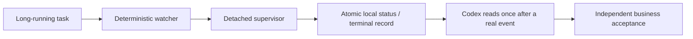

# Codex Monitor Skills

[](https://www.python.org/)
[](LICENSE)

Two complementary [Codex skills](https://developers.openai.com/codex/skills) for monitoring long-running work with detached, deterministic Python supervisors instead of repeated model-driven polling.

> 两个互补的 Codex 长任务监控 skill：让确定性 Python 进程负责等待，让 Codex 只在有语义变化时介入。

## Why this repository exists

Long-running jobs do not need an AI agent to repeatedly ask “are we there yet?”. These skills move unchanged-state observation into small local supervisors and preserve machine-readable terminal evidence for a later Codex turn.

The core design rule is:

> Deterministic software owns observation; the model owns interpretation and business acceptance.



## Included skills

| Skill | Best for | What it observes |
| --- | --- | --- |
| [`codex-long-task-monitor`](codex-long-task-monitor/) | Commands, JSON/file artifacts, callbacks, and Codex dispatches | Transport or artifact completion under an explicit machine-verifiable contract |
| [`codex-hpc-monitor`](codex-hpc-monitor/) | Submitted Slurm training, evaluation, or postflight jobs | Read-only Slurm state through `squeue` and `sacct` |

The HPC skill is the specialized Slurm backend. The general long-task skill routes Slurm work to it and handles artifact/process/dispatch monitoring separately.

## Key properties

- Zero model polling turns while state is unchanged.
- Detached supervisors survive ordinary tool-session or agent-turn exit.
- Atomic, machine-readable local status and terminal records.
- One effective monitor per stable task identity, with a frozen per-monitor contract digest and absolute observation deadlines that restarts cannot extend.
- Explicit separation of transport completion from business success.
- Fail-closed handling for stale PIDs, missing terminal evidence, identity mismatch (including Slurm job-id reuse via submit-time/cluster/SLUID binding), timeout, and lost observability.
- No raw logs, prompts, responses, callbacks, or artifact contents in notification messages.
- Monitoring does not grant authority to start, retry, cancel, mutate, or approve the underlying work.

## Modes and automatic resume

| Mode | Model turns while unchanged | Automatic Codex resume | Long-lived agent slot |
| --- | ---: | ---: | ---: |
| `unattended` (default) | 0 | No | No |
| `external-event-bridge` | 0 | Yes, when an explicitly configured App Server bridge is available | No |
| `attached` (short commands only) | 0 during one blocking call | Same turn only | No subagent slot |
| `goal-worker` | Runtime-dependent | Conditional compatibility mode only | One worker slot |

`unattended` is the default and needs no configuration. The
**experimental** event bridge is opt-in: each monitor started with
`--event-binding` publishes one durable semantic event into a local outbox
after a **verified** terminal record (an HPC terminal with a structurally
valid envelope but unverified watcher result wakes only as
`contract_violation`; pending-threshold alerts publish nothing), and a
delivery daemon you run separately resumes the exact bound Codex thread,
starts one wake turn, holds the session open until `turn/completed`, and
acknowledges only when that notification belongs to the started turn and
has `status=completed`. Failed, interrupted, missing-id, or malformed
completion events never acknowledge delivery. It uses only the stable `initialize`,
`thread/resume`, and `turn/start` App Server methods over stdio, pins
`CODEX_HOME`, and requires the resumed thread's `cwd` to match the bound
workspace. Delivery is at-least-once (no network-level exactly-once is
claimed) with leases renewed throughout delivery, exponential backoff,
dead-lettering, and instance isolation; the woken turn performs an
idempotent postflight guarded by an atomic begin/complete claim plus digest
checks. If a supervisor dies between the terminal record and the event
publication, any later `status`/`wait` observation reconciles it; transient
publication failures remain retryable instead of permanently suppressing
that repair.

A terminal file can never awaken an inactive Codex turn by itself. The
bridge is a notification transport only — never terminal authority — and
until the release gates below are met it stays disabled by default and
labeled experimental. Full setup, failure matrix, and disable procedure:
[`codex-hpc-monitor/references/app-server-bridge.md`](codex-hpc-monitor/references/app-server-bridge.md).

Bridge release gates (partially met): all tests green on supported Pythons,
skill validation for both skills, one opt-in live end-to-end test against a
real Codex App Server, offline/duplicate-delivery and multi-instance
isolation tests, no secrets in fixtures, and an independent review with no
high-severity findings. Default CI uses a deterministic fake App Server and
needs no credentials.

## Command surface

Both supervisors expose `start`, `status`, `wait`, plus:

- `doctor` — one command that reports the negotiated mode, zero-turn
  semantics, agent-slot usage, auto-resume availability, state-root
  filesystem suitability, outbox summary, and (optionally) a live App
  Server probe. `--format text` and `--format json` agree.
- `list` — enumerate local monitors and their states.
- `explain` — plain-language interpretation of one monitor with safe next
  actions.
- `cleanup` — inspect (dry-run by default) and remove settled outbox
  events only; terminal evidence is never touched.

Bridge tooling lives in `scripts/app_server_bridge.py`
(`init-config`, `init-binding`, `status`, `deliver`) and the idempotent
postflight state machine in `scripts/postflight_guard.py` (`begin` → perform
side effects → `complete`; `reset --i-mean-it` only clears an in-progress
claim and never a completed marker; `mark` is only for a single atomic
action). Shared runtime code
(`semantic_events.py`, `app_server_bridge.py`, `postflight_guard.py`) is
vendored as byte-identical copies in each skill so both remain
independently installable; a synchronization test enforces this whenever
both skill directories are present.

## Repository layout

```text
codex-monitor-skills/
├── COMPATIBILITY.md
├── codex-hpc-monitor/
│   ├── SKILL.md
│   ├── agents/openai.yaml
│   ├── references/app-server-bridge.md
│   └── scripts/
├── codex-long-task-monitor/
│   ├── SKILL.md
│   ├── agents/openai.yaml
│   ├── references/
│   └── scripts/
├── LICENSE
└── README.md
```

Each skill is independently installable. Its `SKILL.md` is the authoritative workflow contract; the scripts provide deterministic monitoring mechanics.

## Requirements

Common requirements:

- Linux (the supervisors use Linux process metadata and `fcntl` locking).
- Python 3.10 or newer.
- No third-party Python packages are required.
- A local filesystem for supervisor state and locks. Do not place monitor authority on NFS or another network filesystem.

Additional requirements for `codex-hpc-monitor`:

- Passwordless/non-interactive SSH access to the Slurm login host.
- `squeue` and `sacct` available on the remote host.
- A separately authorized and already-submitted Slurm job.

## Installation

### Install with Codex

Ask the built-in skill installer to install both folders from this repository:

```text
$skill-installer install codex-hpc-monitor and codex-long-task-monitor from https://github.com/ChenLiangyu-sc/codex-monitor-skills
```

Codex normally detects newly installed skills automatically. If they do not appear, restart Codex and use `/skills` to verify discovery.

### Install manually for one user

```bash
git clone https://github.com/ChenLiangyu-sc/codex-monitor-skills.git
cd codex-monitor-skills
mkdir -p "$HOME/.agents/skills"
ln -s "$(pwd)/codex-hpc-monitor" "$HOME/.agents/skills/codex-hpc-monitor"
ln -s "$(pwd)/codex-long-task-monitor" "$HOME/.agents/skills/codex-long-task-monitor"
```

Codex supports symlinked skill directories. You can copy the directories instead if you prefer a snapshot installation.

### Install for one repository

Place the two directories under the target repository's `.agents/skills/` directory:

```text
your-project/
└── .agents/
    └── skills/
        ├── codex-hpc-monitor/
        └── codex-long-task-monitor/
```

## Usage

Explicitly invoke a skill with `$skill-name`, or let Codex select it from the task description.

### Monitor a general long-running task

```text
$codex-long-task-monitor monitor this task until its JSON result records status="completed". Treat transport completion and business acceptance separately.
```

For a detached artifact monitor, the underlying command shape is:

```bash
python3 codex-long-task-monitor/scripts/supervise_artifact.py start \
  /absolute/path/to/result.json \
  --timeout-seconds 28800 \
  --json-field status \
  --success-json '"completed"' \
  --failure-json '"failed"' \
  --expect-json 'request_id="req-123"' \
  --require-nonempty output
```

The launcher returns a `task_handle`. Read local status later without reopening or polling the artifact:

```bash
python3 codex-long-task-monitor/scripts/supervise_artifact.py status <task-handle>
```

See [`references/artifact.md`](codex-long-task-monitor/references/artifact.md) for the full artifact contract and [`references/process.md`](codex-long-task-monitor/references/process.md) for short attached processes.

### Monitor a Slurm job

```text
$codex-hpc-monitor monitor Slurm job 123456 on host hpc142. Expected owner: alice; job name: train-model; partition: gpu.
```

The detached supervisor command shape is:

```bash
python3 codex-hpc-monitor/scripts/supervise_slurm_job.py start 123456 \
  --host hpc142 \
  --poll-seconds 60 \
  --pending-alert-seconds 0 \
  --terminal-observability-seconds 300 \
  --max-watch-seconds 604800 \
  --expected-owner alice \
  --expected-job-name train-model \
  --expected-partition gpu
```

Read the locally persisted state later without opening SSH:

```bash
python3 codex-hpc-monitor/scripts/supervise_slurm_job.py status 123456 --host hpc142
```

Slurm `COMPLETED / 0:0` is scheduler evidence only. It does not prove that a training run, model, or project passed its business acceptance gate.

## Environment-specific integration points

This initial release preserves the original workflow contracts and therefore contains integration paths tailored to the author's environment:

- `codex-hpc-monitor/SKILL.md` expects a separate `hpc-train` skill and uses `hpc142` in examples.
- `codex-long-task-monitor/SKILL.md` references separate `codex-task-dispatch` and `codex-task-routing` skills.
- `monitor_dispatch.py` has a default path for an external dispatch supervisor.

Review and adapt those paths and companion-skill assumptions before using the repository in another environment. Do not weaken the authority boundaries merely to make an example run.

The artifact-monitoring backend is self-contained and is the easiest place to start.

## Safety model

These skills intentionally distinguish four different facts:

1. The monitor is alive.
2. The transport or scheduler reached a terminal state.
3. Expected output was delivered completely.
4. The result passed project-specific business acceptance.

Only the relevant deterministic record can establish the first three, and the main agent must independently perform the fourth. A timeout, missing PID, silent process, HTTP 200, existing file, or Slurm `COMPLETED` state is never enough by itself.

## Development and validation

Validate skill structure with the bundled Codex `skill-creator` validator:

```bash
python3 /path/to/skill-creator/scripts/quick_validate.py codex-hpc-monitor
python3 /path/to/skill-creator/scripts/quick_validate.py codex-long-task-monitor
```

Run the test suites with the Python standard library:

```bash
python3 -m unittest discover -s codex-hpc-monitor/scripts -p 'test_*.py'
python3 -m unittest discover -s codex-long-task-monitor/scripts -p 'test_*.py'
```

Current baseline after the second independent review round: **330 tests
passing** (182 HPC monitor tests and 148 long-task monitor tests),
including the outbox, App Server fake, postflight claim, doctor,
vendored-copy synchronization, and per-skill start-to-wake suites. The
"end-to-end" suites use a deterministic fake App Server: they verify the
full local chain (start with binding -> verified terminal -> outbox ->
delivery daemon -> fixed wake template -> awaited turn/completed ->
idempotent postflight claim) but **not** a real Codex App Server or a real
model turn. No credentials or network access are required. An opt-in live
lifecycle smoke was also run successfully with Codex CLI 0.150.1 on
2026-08-28 (real thread resume, wake turn, strict `turn/completed`, and
outbox acknowledgement); it is not part of default CI and does not by
itself prove the woken model performed a business postflight correctly.

## Contributing

Issues and pull requests are welcome. Changes should preserve the core invariants:

- unchanged state must not consume model turns;
- watcher identity and terminal evidence must be verifiable;
- timeout or observability loss must never imply success or retry authority;
- transport completion must remain separate from business acceptance;
- sensitive task content must not leak into compact notification events.

## License

Released under the [MIT License](LICENSE).
